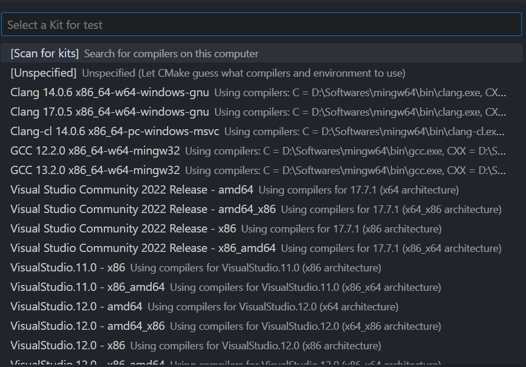
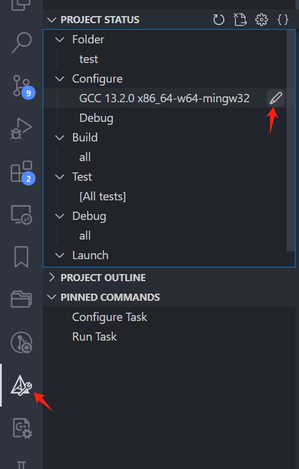

# CMAKE项目结构  

使用CMAKE构建c/c++项目通用的框架  

## 编译此项目  

在根目录下运行（使用MinGW-w64）：  

```terminal
# cmake -S . -B build -G="MinGW Makefiles"
# cd build
# make
```

生成的可执行文件在`build/examples`中。  

## 使用VSCode  

使用VSCode编辑器，装上CMAKE和CMAKE-TOOLS插件，可以更好支持CMAKE项目构建。如果我们已经写好了CMakeLists.txt，那么打开项目就会让我们选择编译器：  

  

或者从VSCode中选择：  

  

另外，使用`Ctrl+Shift+P`，输入`Cmake: Quick Start`可以从零开始新建一个CMAKE项目，现在CMAKE有Preset，可以简化多人协作的项目配置，不同机器也能迅速配置好项目，专注于开发，有需求可以学习一下。  
